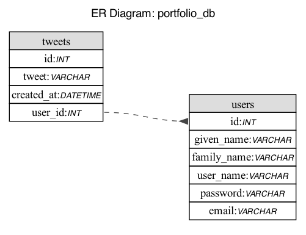
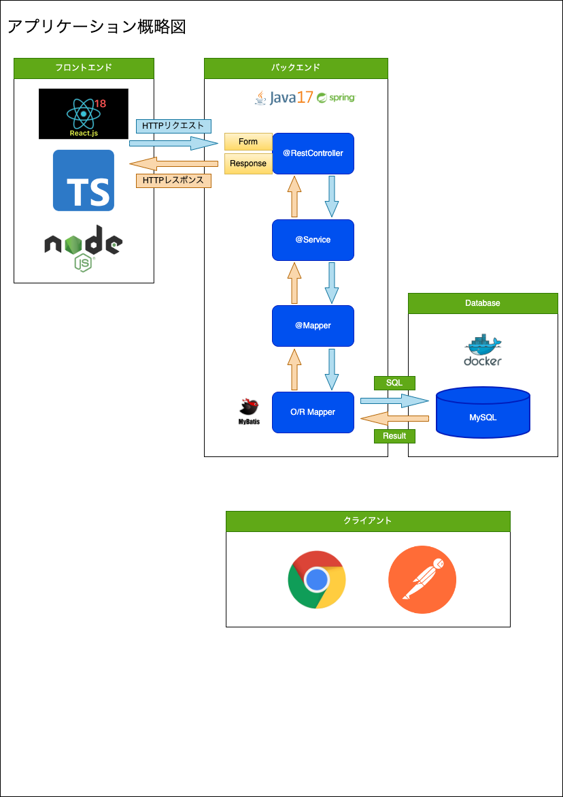

# Tweeterのクローンアプリ
[](https://skillicons.dev)

[](https://skillicons.dev)  

## API概要
Tweeterのクローンアプリになります。<br />
ユーザー登録、更新とツイート投稿、閲覧が出来ます。

## 要件
- ユーザー登録、更新処理のREST API作成
- ユーザー登録、更新画面とフロント側の処理を作成
- ツイート投稿、閲覧機能のREST API作成
- ツイート投稿、閲覧画面とフロント側の処理を作成

## 使用技術(バックエンド)
- java 17.0.7
- Spring Boot 3.1.0
- O/Rマッパー
  - MyBatis 3.2.0
- Docker
  - MySQL 8.0

## 使用技術(フロントエンド)
- React.js 18.2.0
- TypeScript 4.9.5
- axios 1.4.0
- Chakra UI 

## 使用ツール
|        ツール名        |     用途      |
|:------------------:|:-----------:|
|      InteliJ       | バックエンドの開発用  |
| Visual Studio Code | フロントエンドの開発用 |
|      Postman       | バックエンドのテスト用 |
|   GitHub Action    |  API仕様書作成用  |

## ER図


## 概略図


## 成果物
### [Tweeterクローンアプリ API仕様書](apiSpecification/docs/index.html)

## ディレクトリー構造
```
.
├── java
│   └── com
│       └── example
│           └── portfolio
│               └── java
│                   └── mysql
│                       ├── Application.java
│                       ├── controller
│                       │   ├── LoginResponse.java
│                       │   ├── TweetController.java
│                       │   ├── TweetResponse.java
│                       │   └── UserController.java
│                       ├── entity
│                       │   ├── Tweet.java
│                       │   └── User.java
│                       ├── exception
│                       │   ├── CustomExceptionHandler.java
│                       │   └── ResourceNotFoundException.java
│                       ├── form
│                       │   ├── LoginForm.java
│                       │   ├── TweetForm.java
│                       │   ├── UserForm.java
│                       │   └── UserUpdateForm.java
│                       ├── mapper
│                       │   ├── TweetMapper.java
│                       │   └── UserMapper.java
│                       └── service
│                           ├── TweetService.java
│                           ├── TweetServiceImpl.java
│                           ├── UserService.java
│                           └── UserServiceImpl.java
└── resources
    ├── application.properties
    └── com
        └── example
            └── portfolio
                └── java
                    └── mysql
                        └── mapper
                            ├── TweetMapper.xml
                            └── UserMapper.xml
```

## アプリケーションの起動方法
0.Java17, Node20.2.0, git, Dockerのインストール済ませてください。<br />
1.コードをクローンする場所に移動する。
```
$ cd 任意のディレクトリー
```
2.コードをクローンする。
```
$ git clone https://github.com/yoshiki2016/portfolio_2023_react_java_mysql.git
```
3.クローンしたディレクトリーに移動する。
```
$ cd portfolio_2023_react_java_mysql
```
4.DockerのMySQLコンテナを立ち上げる。
```
$ cd docker
$ docker compose up
```
5.Springを起動する。
```
$ cd portfolio_2023_react_java_mysql
$ ./gradlew
```
6.Nodeのパッケージをインストールして、Nodeサーバー起動する。
```
$ cd portfolio_2023_react_java_mysql
$ cd frontend
$ npm i
$ ls | grep node
node_modules/
$ npm run start
```
7.ブラウザを立ち上げて以下にアクセスする。
```
http://localhost:3000/
```

## 今後の課題
- RedisかAPI GateWayを使った認証にする。
- Chakura UIを使ったデザインに関してスタイルの調整を出来るようにする。
- ログイン処理で失敗した際のHTTP Statusを401か403に変える。
- バリデーションチェックをフロントとバックエンドに設ける。
- フロントエンドに関して、async/awaitやpromisを理解し非同期処理の順番を制御出来るようにする。
- Jestを使ったフロントエンドのテスト実装をする。
- PHP、RubyでREST APIのCRUD処理とユニットテスト作成経験を積む。
